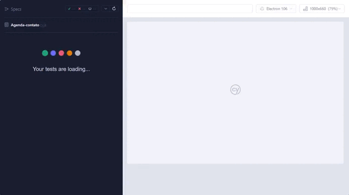

**Curso Desenvolvedor Fullstack Java**

<h1>

</h1>

**No exercício você deverá:**

1) Criar um projeto de testes utilizando o Cypress;
2) No script de testes você deverá testar as funcionalidades da aplicação disponível no link https://agenda-contatos-react.vercel.app/;
3) Testar as funcionalidades:
inclusão;
alteração;
remoção de um contato;
4) No repositório do curso, criar uma branch chamada exercicio_cypress;
5) Armazenar nessa branch o conteúdo do projeto de teste;
6) Enviar o link do repositório através da plataforma.

**Configurando o cypress no projeto**

**Instalação e inicialização**
```
npm init -y 

npm install --save-dev cypress@12.6.0

```
**Para abrir o cypress**

``` 
npm run cypress open

```
**Para testar os testes**

```
npm run cypress open

```
```bash
# Versões mínimas ou superiores.
 node -v
v12.18.0

 npm -v
6.14.4
```
```bash
# Clonar o repositório
 git clone https://github.com/vivianezzt/exercicio_testes-Agenda_contato_ebac

#Entrar no diretório
 cd EBAC-Cypress

#Instalar as dependências
 npm install

#Iniciar o cypress
 npx cypress open
```



**Desenvolvido por Viviane Aguiar**